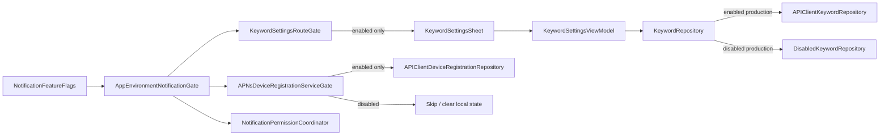

# Design Document

## Overview

Issue #111 は、次フェーズ用として入っているキーワード通知関連の API 到達経路を、iOS v1 default では明示的に無効化する設計である。対象は `/api/devices` と `/api/keywords` の呼び出し抑止、drawer の keyword settings 導線非表示、APNs device registration / retry / logout unregister の no-network 化、README の v1 smoke checklist 明記に限定する。

既存の #54 APNs device registration foundation、#55 Keyword repository / settings UI、#56 notification article deep link は削除しない。`AppEnvironment.production()` が default で v1 scope に沿う設定を組み立て、明示的に feature flag を enabled にした場合だけ既存 next phase repository / ViewModel / sheet が動く境界を固定する。

**Purpose**: この機能は「v1 server に未実装 next phase API を呼ばない」安全性を Feedman の v1 release owner と v1 user に提供する。
**Users**: v1 user が通常の login / timeline / drawer / logout workflow を使うとき、keyword notification UI と device registration network side effect を見ずに利用する。
**Impact**: 現在の production wiring が real `/api/devices` / `/api/keywords` path を持つ状態を、default disabled feature gate と disabled-path tests によって v1 scope と整合する状態へ変える。

### Goals

- `AppEnvironment.production()` default で keyword notification / APNs device registration を disabled にする。
- Disabled 時に drawer から `KeywordSettingsSheet` を表示せず、`/api/keywords` を呼ばない。
- Disabled 時に APNs bridge、remote notification registration、login/session restore retry、logout unregister が `/api/devices` を呼ばない。
- Enabled 時は既存 repository / ViewModel / sheet / request contract tests を維持する。
- README の v1 smoke checklist に `/api/devices` と `/api/keywords` が v1 default 対象外であることを明記する。

### Non-Goals

- Keyword settings UI、repository、ViewModel、APNs device registration foundation の削除。
- サーバー側 `/api/devices` / `/api/keywords` の実装、契約変更、mock response shape 変更。
- Remote config、A/B testing、server-driven feature flag。
- Push worker、FCM/APNs 配信、notification category action、App Store APNs entitlement 設定。
- Notification article deep link の再設計。ただし `/api/devices` 抑止に必要な bridge gating は対象に含む。

## Architecture

### Existing Architecture Analysis

- 既存アーキテクチャは MVVM + Repository。API 型と repository protocol / implementation は `Feedman/Core`、UI と ViewModel は `Feedman/Features/*` に分かれている。
- `AppEnvironment.production(apiBaseURL:)` は shared `APIClient` と refresh hook を作り、`APIClientKeywordRepository` と `APIClientDeviceRegistrationRepository` を real dependency として注入している。この production wiring が今回の主な変更点になる。
- `RootView` は `DrawerView` に `onShowKeywordSettings` を渡し、`AppShellPresentation.keywordSettings` で `KeywordSettingsSheet` を表示する。UI gating はこの AppShell 境界で完結させる。
- `APNsDeviceRegistrationService` は token registration retry と logout unregister の state machine を持つ。Disabled default では service 内に feature gate を持たせ、既存の retry / unregister call sites を散らさず no-network 結果へ短絡する。
- `NotificationPermissionCoordinator` は permission request 後に `UIApplication.shared.registerForRemoteNotifications()` を呼ぶ。Disabled default では production wiring が unavailable provider / registrar を使う、または coordinator 側の gate で remote registration を抑止する。
- `NotificationArticleNavigationBridge` は article detail presentation に接続されているが、`/api/devices` / `/api/keywords` を呼ばない。今回の gate 対象は keyword settings と device registration に限定し、article detail deep link は不要に壊さない。

### Architecture Pattern & Boundary Map



**Architecture Integration**:
- 採用パターン: Feature flag + MVVM + Repository。Feature flag は `AppEnvironment` が owning dependency として保持し、View / service は raw config source を直接読まない。
- ドメイン／機能境界: `Feedman/Core` は flag と repository dependency wiring、`Feedman/Features/AppShell` は UI 導線、`Feedman/Features/Notifications` は APNs service / permission coordination の runtime behavior を担当する。
- 既存パターンの維持:
  - APIClient の Bearer / refresh retry hook は enabled path でそのまま使う。
  - Repository protocol と mock / real 差し替え可能性を維持する。
  - `@MainActor` AppEnvironment / ViewModel と actor-based APNs service の境界を維持する。
- 新規コンポーネントの根拠:
  - `NotificationFeatureFlags` は v1 default と next phase enabled を同じ production entry point で切り替えるため必要。
  - `DisabledKeywordRepository` は防御的に sheet が呼ばれても `/api/keywords` に到達しない testable boundary として必要。
  - `APNsDeviceRegistrationServiceGate` は retry/logout call site を散らさず `/api/devices` 抑止を保証するため必要。

### Technology Stack

| Layer | Choice / Version | Role in Feature | Notes |
|-------|------------------|-----------------|-------|
| Frontend / CLI | SwiftUI / iOS 16+ | Drawer footer entry の表示制御、sheet presentation 防御 | 新規 UI surface は追加しない |
| Backend / Services | Existing Feedman API | Enabled path の `/api/devices` / `/api/keywords` | v1 default では呼ばない |
| Data / Storage | `UserDefaultsDeviceRegistrationStateStore` / in-memory test store | Disabled 時の stale device id cleanup と enabled path の既存 state | 新規永続 schema なし |
| Messaging / Events | AppShell presentation state / APNs bridge | Drawer tap、APNs token callback、login retry、logout unregister | Notification article deep link は維持 |
| Infrastructure / Runtime | `APIClient`, XCTest, README smoke checklist | Enabled path request contract と disabled path regression | 実 APNs / 実 network に依存しない unit tests |

## File Structure Plan

### Directory Structure

```text
Feedman/
├── Core/
│   ├── AppEnvironment.swift                  # NotificationFeatureFlags / AppEnvironmentNotificationGate
│   ├── KeywordRepository.swift               # DisabledKeywordRepository を追加し enabled path の API repo は維持
│   └── DeviceRegistrationRepository.swift    # 既存 API repo は維持。必要なら disabled error / outcome を補助
├── Features/
│   ├── AppShell/
│   │   ├── RootView.swift                    # KeywordSettingsRouteGate: drawer entry 非表示と sheet presentation 防御
│   │   └── AppShellState.swift               # 必要なら disabled request no-op の防御 helper を追加
│   └── Notifications/
│       ├── APNsDeviceRegistrationService.swift       # APNsDeviceRegistrationServiceGate: disabled short-circuit
│       ├── NotificationPermissionCoordinator.swift    # remote notification registration 抑止境界
│       ├── KeywordSettingsViewModel.swift             # enabled path 維持。disabled path では AppShell から起動しない
│       └── KeywordSettingsSheet.swift                 # ExistingNextPhaseComponents: enabled path 維持
├── FeedmanApp.swift                          # production default 呼び出しは維持。引数なし default が disabled になる
└── Info.plist                                # 変更なし

FeedmanTests/
├── AppEnvironmentSessionRestoreTests.swift   # DisabledPathRegressionTests: production default / login/restore retry 抑止
├── AppEnvironmentLogoutTests.swift           # DisabledPathRegressionTests: disabled logout unregister no-network
├── APNsDeviceRegistrationServiceTests.swift  # disabled token / retry / unregister short-circuit
├── NotificationPermissionCoordinatorTests.swift # disabled remote registration 抑止
├── AppShellStateTests.swift                  # disabled presentation 防御または existing enabled behavior
├── KeywordRepositoryTests.swift              # APIClientKeywordRepository tests 維持、DisabledKeywordRepository no-network
└── KeywordSettingsViewModelTests.swift       # enabled path の既存 ViewModel tests 維持

README.md                                    # V1SmokeChecklist: next phase API 対象外を明記
```

### Modified Files

- `Feedman/Core/AppEnvironment.swift` — `NotificationFeatureFlags` を保持し、`production()` default を disabled にする。明示 enabled 引数では existing real repositories / permission coordinator / APNs service を使う。
- `Feedman/Core/KeywordRepository.swift` — `DisabledKeywordRepository` または同等の disabled boundary を追加し、誤到達時も `/api/keywords` を送らない。
- `Feedman/Features/Notifications/APNsDeviceRegistrationService.swift` — disabled 時に token registration / pending retry / logout unregister を short-circuit し、必要に応じて local state を clear する。
- `Feedman/Features/Notifications/NotificationPermissionCoordinator.swift` — disabled production wiring で remote notification registration を呼ばない構成にする。実装は coordinator gate または unavailable registrar injection のどちらでもよい。
- `Feedman/Features/AppShell/RootView.swift` — `environment.notificationFeatures.keywordNotificationsEnabled` を使って drawer の「キーワード通知」を非表示にし、sheet content も防御的に disabled 時は no-op / dismiss へ寄せる。
- `Feedman/Features/AppShell/AppShellState.swift` — UI gating を `RootView` だけで完結できない場合に限り、disabled presentation request を no-op にする helper を追加する。
- `README.md` — v1 smoke checklist に `/api/devices` と `/api/keywords` が v1 default 対象外であることを追記する。

## Requirements Traceability

| Requirement | Summary | Components | Interfaces | Flows |
|-------------|---------|------------|------------|-------|
| 1.1, 1.2, 1.3, 1.4, 1.5 | Production default disabled / enabled injection | NotificationFeatureFlags, AppEnvironmentNotificationGate, DisabledKeywordRepository | State / Service | production wiring |
| 2.1, 2.2, 2.3, 2.4, 2.5 | Keyword settings UI route gating | KeywordSettingsRouteGate, DisabledKeywordRepository | State / Service | drawer -> sheet defense |
| 3.1, 3.2, 3.3, 3.4, 3.5, 3.6, 3.7 | `/api/devices` suppression | APNsDeviceRegistrationServiceGate, AppEnvironmentNotificationGate | State / Service | APNs token, retry, logout |
| 4.1, 4.2, 4.3, 4.4, 4.5 | Next phase preservation | ExistingNextPhaseComponents | Service / State | enabled path tests |
| 5.1, 5.2, 5.3, 5.4 | Smoke checklist and verification | V1SmokeChecklist, DisabledPathRegressionTests | Docs / Tests | README and xcodebuild |

## Components and Interfaces

### Core

#### NotificationFeatureFlags

| Field | Detail |
|-------|--------|
| Intent | v1 default と next phase enabled の切替を表す AppEnvironment-owned state |
| Requirements | 1.1, 1.4, 1.5 |

**Responsibilities & Constraints**
- `keywordNotificationsEnabled` を唯一の public flag とし、device registration は keyword notification feature に従属させる。
- Default は v1 scope に合わせて disabled。
- Remote config や server fetch は持たず、production initializer argument / tests / previews から注入する。

**Dependencies**
- Inbound: `AppEnvironment.production()` — default / explicit enabled wiring (Critical)
- Outbound: `RootView`, `APNsDeviceRegistrationService`, `NotificationPermissionCoordinator` — runtime gate 判断 (Critical)

**Contracts**: State [x]

##### State Contract

```swift
struct NotificationFeatureFlags: Equatable {
    let keywordNotificationsEnabled: Bool

    static let v1Default: NotificationFeatureFlags
    static let nextPhaseEnabled: NotificationFeatureFlags
}
```

- Preconditions: `AppEnvironment` construction 時に確定する。
- Postconditions: 同一 environment lifetime 中に暗黙変更しない。
- Invariants: v1 default は `keywordNotificationsEnabled == false`。

#### AppEnvironmentNotificationGate

| Field | Detail |
|-------|--------|
| Intent | Feature flag に応じて production dependency graph を disabled / enabled に分岐する |
| Requirements | 1.1, 1.2, 1.3, 1.4, 1.5, 3.3, 3.4 |

**Responsibilities & Constraints**
- `AppEnvironment` が `notificationFeatures` を公開し、UI と service が同じ source of truth を見る。
- Disabled production では active runtime dependency に real device / keyword API repository を渡さない。
- Enabled production では既存 real repository と APNs service / permission coordinator を再利用する。
- Login completion と session restore の pending device retry は service gate に委譲し、call site ごとの条件分岐を増やしすぎない。

**Dependencies**
- Inbound: `FeedmanApp` — `AppEnvironment.production()` を呼ぶ (Critical)
- Outbound: `KeywordRepository`, `APNsDeviceRegistrationService`, `NotificationPermissionCoordinator` — dependency construction (Critical)
- External: `APIClient` — enabled path の API transport (Critical)

**Contracts**: Service [x] / State [x]

##### Service Interface

```swift
static func production(
    apiBaseURL: URL = URL(string: "http://localhost:3000")!,
    notificationFeatures: NotificationFeatureFlags = .v1Default
) -> AppEnvironment
```

- Preconditions: default argument は v1 scope の disabled。
- Postconditions: Disabled default は `/api/devices` / `/api/keywords` を送信可能な active dependency graph を持たない。
- Invariants: `FeedmanApp.swift` の引数なし呼び出しは disabled default を使う。

#### DisabledKeywordRepository

| Field | Detail |
|-------|--------|
| Intent | Disabled 時の誤到達を no-network failure として閉じる |
| Requirements | 1.3, 2.3, 2.5, 5.2 |

**Responsibilities & Constraints**
- `KeywordRepository` protocol を満たすが、全 method で network を行わない。
- Error は UI 表示可能な feature disabled / unavailable 系に寄せる。AppShell disabled path では通常呼ばれない。
- `APIClientKeywordRepository` の enabled path tests は維持する。

**Dependencies**
- Inbound: `AppEnvironmentNotificationGate`, defensive `KeywordSettingsViewModel` tests (Important)
- Outbound: none (Critical for no-network guarantee)

**Contracts**: Service [x]

##### Service Interface

```swift
struct DisabledKeywordRepository: KeywordRepository {
    func keywords(accessToken: String) async throws -> [KeywordResponse]
    func createKeyword(_ request: KeywordCreateRequest, accessToken: String) async throws -> KeywordResponse
    func updateKeyword(id: String, request: KeywordUpdateRequest, accessToken: String) async throws -> KeywordResponse
    func deleteKeyword(id: String, accessToken: String) async throws
}
```

- Preconditions: Disabled default wiring で使う。
- Postconditions: `APIClient` / `URLSession` へ到達しない。
- Invariants: Enabled path の request contract は `APIClientKeywordRepository` に残す。

### Notifications Feature

#### APNsDeviceRegistrationServiceGate

| Field | Detail |
|-------|--------|
| Intent | Device registration service の registration / retry / unregister を disabled 時に no-network 化する |
| Requirements | 1.2, 3.1, 3.3, 3.4, 3.5, 3.6, 3.7, 5.2 |

**Responsibilities & Constraints**
- Disabled 時の `registerDeviceToken` は repository を呼ばず、pending token を保持しない。
- Disabled 時の `retryPendingRegistrationIfPossible` は repository を呼ばず `nil` または disabled outcome を返す。
- Disabled 時の `unregisterKnownDeviceForLogout` は repository を呼ばず local state を clear し、logout を block しない success outcome を返す。
- Enabled 時は既存の APNs token formatting、duplicate in-flight suppression、retry、logout unregister behavior を維持する。

**Dependencies**
- Inbound: `APNsDeviceRegistrationBridge`, `AppEnvironment.completeLogin`, `AppEnvironment.restoreSessionAtLaunch`, `AppEnvironment.logout` (Critical)
- Outbound: `DeviceRegistrationRepository`, `DeviceRegistrationStateStore` — enabled registration and state cleanup (Critical)

**Contracts**: Service [x] / State [x]

##### Service Interface

```swift
actor APNsDeviceRegistrationService {
    init(
        repository: any DeviceRegistrationRepository,
        stateStore: any DeviceRegistrationStateStore,
        featureFlags: NotificationFeatureFlags,
        tokenFormatter: APNsDeviceTokenFormatter = APNsDeviceTokenFormatter(),
        accessTokenProvider: @escaping AccessTokenProvider
    )
}
```

- Preconditions: Disabled default では `featureFlags.keywordNotificationsEnabled == false`。
- Postconditions: Disabled path は `/api/devices` POST / DELETE を送らず、stale local state cleanup は network に依存しない。
- Invariants: Enabled path の `APIClientDeviceRegistrationRepository` tests は維持する。

#### NotificationPermissionCoordinator

| Field | Detail |
|-------|--------|
| Intent | Disabled 時に remote notification registration を要求しない |
| Requirements | 3.2, 3.7 |

**Responsibilities & Constraints**
- Disabled production では `UIApplication.shared.registerForRemoteNotifications()` が呼ばれない構成にする。
- 既存 permission status mapping と authorization request tests は enabled path として維持する。
- UI 導線が disabled default で消えるため、permission request 自体は通常起動しない。Defensive tests では coordinator 単体で no remote registration を確認する。

**Dependencies**
- Inbound: future keyword settings enabled flow (Important)
- Outbound: `NotificationAuthorizationProviding`, `RemoteNotificationRegistering` (Important)

**Contracts**: Service [x]

### AppShell Feature

#### KeywordSettingsRouteGate

| Field | Detail |
|-------|--------|
| Intent | Drawer entry と sheet presentation を feature flag で制御する |
| Requirements | 2.1, 2.2, 2.3, 2.4, 2.5 |

**Responsibilities & Constraints**
- Disabled 時は drawer footer に「キーワード通知」を表示しない。
- Disabled 時は `KeywordSettingsSheet` を生成せず、`KeywordSettingsViewModel.loadKeywords()` を始めない。
- Defensive に `.keywordSettings` presentation が入っても disabled 時は dismiss / no-op し、network を呼ばない。
- Enabled 時は既存 footer action と sheet content を維持する。

**Dependencies**
- Inbound: `RootView.authenticatedShell`, `DrawerView` (Critical)
- Outbound: `KeywordSettingsSheet`, `AppShellState`, `AppEnvironment.notificationFeatures` (Critical)

**Contracts**: State [x]

##### State Interface

```swift
private struct DrawerView: View {
    let isKeywordSettingsEnabled: Bool
    let onShowKeywordSettings: () -> Void
}
```

- Preconditions: `RootView` が `environment.notificationFeatures.keywordNotificationsEnabled` を渡す。
- Postconditions: Disabled 時は user interaction で `.keywordSettings` を作らない。
- Invariants: Account、theme、feed registration、subscription settings footer は変更しない。

### Documentation / Tests

#### V1SmokeChecklist

| Field | Detail |
|-------|--------|
| Intent | v1 manual smoke の対象外 API を README に明示する |
| Requirements | 5.1 |

**Responsibilities & Constraints**
- README の v1 smoke checklist に `/api/devices` と `/api/keywords` が default v1 対象外であることを追記する。
- Endpoint table を README に重複管理しない既存方針は維持する。

**Contracts**: Docs [x]

#### DisabledPathRegressionTests

| Field | Detail |
|-------|--------|
| Intent | Disabled default で `/api/devices` / `/api/keywords` が呼ばれないことを単体テストで示す |
| Requirements | 5.2, 5.3, 5.4 |

**Responsibilities & Constraints**
- Recording repositories / transports で disabled path の call count が 0 であることを検証する。
- Enabled path の既存 request contract / ViewModel tests を削らない。
- 実 APNs、実 network、実 Keychain、実 OAuth に依存しない。

**Contracts**: Service [x] / State [x]

#### ExistingNextPhaseComponents

| Field | Detail |
|-------|--------|
| Intent | #54/#55/#56 で入った next phase 実装を enabled path として維持する |
| Requirements | 4.1, 4.2, 4.3, 4.4, 4.5, 5.3 |

**Responsibilities & Constraints**
- `APIClientDeviceRegistrationRepository`、`APIClientKeywordRepository`、`KeywordSettingsViewModel`、`KeywordSettingsSheet`、notification article deep link source を削除しない。
- Existing tests は feature flag enabled または direct repository / ViewModel construction に寄せて維持する。
- Scope guard として、今回の変更を `/api/devices` / `/api/keywords` 抑止と README 更新に閉じる。

**Dependencies**
- Inbound: future next phase enabling work (Important)
- Outbound: `APIClient`, `KeywordSettingsViewModel`, `KeywordSettingsSheet`, `APNsDeviceRegistrationService` (Important)

**Contracts**: Service [x] / State [x]

## Data Models

### Domain Model

- `NotificationFeatureFlags`
  - Aggregate boundary: App session / environment lifetime。
  - Entity ではなく immutable value object。
  - `keywordNotificationsEnabled == false` は v1 default の invariant。
- Device registration state
  - 既存 `DeviceRegistrationState(deviceID:)` を維持する。
  - Disabled logout / account deletion cleanup は local state を clear してよいが、server unregister 成功を前提にしない。
- Keyword models
  - 既存 `KeywordResponse` / create / update request を維持する。
  - Disabled default は keyword model をロードしない。

### Logical / Physical Data Model

新規永続データモデルは追加しない。`UserDefaultsDeviceRegistrationStateStore` の既存 key は維持し、disabled cleanup は同 store の `clear()` を使う。

## Error Handling

### Error Strategy

- Disabled path は「ネットワーク失敗」ではなく「feature disabled / skipped」として扱う。通常 UI では drawer entry が無いため user-facing error は出ない。
- Defensive に disabled repository / sheet に到達した場合は、`KeywordSettingsViewModel` が generic unavailable guidance へ変換できる domain error を返す。ただし AppShell は disabled 時に sheet を生成しない。
- Logout / account deletion の disabled cleanup は best-effort。`DELETE /api/devices/{id}` を試行せず、local auth state transition を block しない。
- Enabled path の API errors は既存 `FeedmanAPIError` / ViewModel error mapping を維持する。

### Error Categories and Responses

- **User Errors (4xx)**: Enabled path の auth-required / duplicate / validation は既存 `KeywordSettingsViewModel` と `APIClient` の mapping を維持する。Disabled default では UI 導線が無いため通常発生しない。
- **System Errors (5xx)**: Enabled path の server / network failure は既存 recoverable UI を維持する。Disabled path は API を呼ばないため 5xx を生成しない。
- **Business Logic Errors (422)**: Enabled path の keyword validation は既存 UI guidance を維持する。Disabled path の feature disabled は defensive no-op / unavailable として扱う。

## Testing Strategy

- **Unit Tests**:
  - `AppEnvironment.production()` default が disabled flags を持ち、keyword repository が real API repo ではないことを検証する。
  - `APNsDeviceRegistrationService` disabled token / retry / logout unregister が recording repository を呼ばないことを検証する。
  - `RootView` / route gate の pure helper または state-level tests で disabled 時に keyword settings presentation が起動しないことを検証する。
  - `DisabledKeywordRepository` が `APIClient` に依存せず no-network error を返すことを検証する。
  - Enabled path の `APIClientDeviceRegistrationRepository` / `APIClientKeywordRepository` request contract tests を維持する。
- **Integration Tests**:
  - `AppEnvironment.completeLogin` disabled default で pending device retry が `/api/devices` を呼ばないことを recording repository で確認する。
  - `AppEnvironment.restoreSessionAtLaunch` disabled default で pending retry が `/api/devices` を呼ばないことを確認する。
  - `AppEnvironment.logout` disabled default で known local device id があっても `DELETE /api/devices/{id}` を呼ばず unauthenticated へ進むことを確認する。
  - Enabled configuration で既存 APNs registration / logout unregister tests が引き続き通ることを確認する。
- **E2E/UI Tests**:
  - XCTest UI test は新設しない。`DrawerView` の表示分岐は可能な範囲で view model / state helper に寄せて unit test する。
  - 手動 smoke では v1 default drawer に「キーワード通知」が表示されないことを README に沿って確認する。
  - `KeywordSettingsSheet` は enabled path の既存 ViewModel / repository unit tests により維持する。
- **Performance/Load**:
  - Disabled path は network request を削減するだけであり、新規 load target はない。
  - Login / restore / logout の short-circuit は actor 内の定数分岐に留める。
  - README / tests 以外の runtime overhead は `NotificationFeatureFlags` の value check に限定する。

## Security Considerations

- Disabled path は APNs token と Bearer token を送信しないため、v1 server に next phase token material が到達しない。
- Disabled cleanup は APNs token、Bearer token、refresh token、keyword term、personal article data を log しない。
- Enabled path は既存 `APIClient` Bearer auth / refresh retry に委譲し、Notifications feature に独自 token refresh logic を追加しない。

## Alternatives Considered

- **採用案: AppEnvironment-owned feature flag + service/UI gates**
  Production default と tests が同じ dependency graph を検証でき、future enabled path を維持しやすい。
- **代替案: Keyword settings UI だけを非表示にする**
  `/api/keywords` は止まるが、APNs bridge / retry / logout unregister が `/api/devices` を呼ぶ可能性が残るため不採用。
- **代替案: next phase files を削除する**
  Issue 要件が「repository / ViewModel / sheet は削除せず隔離」と明記しているため不採用。

## Supporting References

- `design/SPEC-iOS.md` §7: `/api/devices` と `/api/keywords` は次フェーズ、v1 では実装しない。
- `design/SERVER.md` §2: キーワードプッシュ通知 API は次フェーズの正本。
- `docs/specs/54-apns-device-registration-foundation/requirements.md`: APNs device registration foundation の既存 enabled path。
- `docs/specs/55-keyword-crud-repository-and-settings-ui/design.md`: Keyword repository / settings UI の既存 enabled path。
